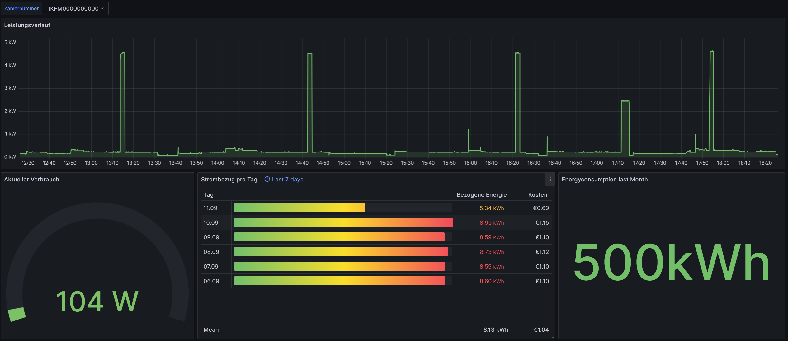
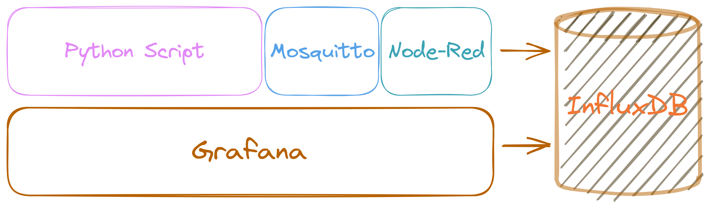

# Funktion
Der Pythoncode dieses Projekts basiert auf dem Beta-Code von [greenMikeEU](https://github.com/greenMikeEU) für das **Bundesland Vorarlberg**.<br>
In seinem [Blogartikel](https://www.michaelreitbauer.at/kaifa-ma309-auslesen-smart-meter-evn/) wird beschrieben, wie Daten osterreichischer Stromzähler vom Typ `Kaifa Drehstromzähler MA309` automatisiert ausgelesen, gespeichert und visualisiert werden können.<br>  


Dabei kommen folgende Softwarekomponenten zum Einsatz:
- **Python Script** zum Auslesen des Zählers
- [**Mosquitto**](https://mosquitto.org/) als MQTT Broker, über den die rohen Daten versendet werden
- [**Node-Red**](https://nodered.org/) zur automatisierten Abspeicherung der Daten in einer Datenbank
- [**InfluxDB**](https://www.influxdata.com) als Datenbank für die Zeitreihen-Datensätze
- [**Grafana**](https://grafana.com/) zur Visualisierung der Daten

Die verschiedenen Komponenten wurden in diesem Repository mithilfe von [Docker](https://www.docker.com/) und docker-compose containerisiert und können so mit nur einem einzigen Befehl gestartet werden.



Dabei sind die Container beim Start bereits voll konfiguriert. Die Konfiguration basiert auf den weiterführenden Blogartikeln (*[MQTT Nachrichten in Datenbank speichern](https://www.michaelreitbauer.at/mqtt-nachrichten-in-datenbank-speichern/), [Smartmeter Dashboard in Grafana](https://www.michaelreitbauer.at/smart-meter-dashboard-in-grafana-influxdb/)*) von Michael Reitbauer.

# Unterstützte Zähler

-   [Kaifa Drehstromzähler MA309M<sub>H4LAT1</sub> (Vorarlberg)](#HSmartMeterVKW)
-   Potentiell weitere (ungetestet)


# <a id="HSmartMeterVKW"></a>SmartMeterVKW
Das Skript `SmartMeterVKW.py` ermöglicht den Zugriff auf den Vorarlberger Smartmeter vom Typ MA309M<sub>H4LAT1</sub>. Der Code kann auch außerhalb des Dockercontainers ausgeführt werden. Dies ist weiter unten beim Punkt [*Python außerhalb von Docker ausführen*](#RunPythonStandalone) genauer beschrieben.


## Voraussetzungen
#### Hardware
-   Kaifa MA309<sub>H4LAT1</sub>
-   Passwort für die Kundenschnittstelle
    -   Der Schüssel kann Online im **Kundenportal** des Stromanbierters angefordert werden.
-   Raspberry Pi
-   [USB zu MBus Adapter](https://www.ebay.at/itm/144514262822)
#### Software

- Raspberry Pi OS 32bit (ungetestet für 64bit)
- Docker und Docker-compose
    - Diese können entweder manuell oder mithilfe des `install.sh` Skripts installiert werden.
## Getting Started

- Installieren Sie die benötigte Software entweder manuell oder mithilfe des `install.sh` Skripts.  
- <a id="configjsonAnlegen"></a>Als Nächstes muss im Ordner `config/` eine Datei `config.json` nach Vorlage der `config.example.json` angelegt werden, welche die nötigen Informationen erhält. Zu beachten ist jedoch, dass diese Informationen von den Umgebungsvariablen im `docker-compose.yml` größtenteils überschrieben werden. 
- Die meisten Einstellungen die das `docker-compose.yml` verwendet werden aus der `.env` Datei geholt, diese muss auch noch manuell erstellt werden. Folgende Werte sollten hierbei gesetzt werden:  
    ``` 
    ReaderKey= --Kundenschnittstellen Schlüssel--
    Comport=/dev/ttyUSB0
    mosquittoPort=1883
    nodeRedPort=1880
    influxPort=8086
    grafanaPort=3000
    grafanaRootPassword="$ecurePasswordGrafana123"

    influxdbAdminUser="root"
    influxdbAdminPassword="q^9F1$iE1iX6LCtxzOJLWHVrRHxB@WSkp8p4fYcf"
    influxdbUser="smartmeteruser"
    influxdbUserPassword="$ecurePasswordInflux123"
    influxdbDatabase="SmartMeter"
    ```
    Diese Werte können individuell angepasst werden, jedoch sollte beachtet werden, dass diese an mehreren Stellen (z.B `grafana_datasource.yml`, `flows.json`, usw.) hartkodiert hinterlegt sind.
- Nun können die Container mit dem Befehl 
  ```
  docker-compose up
  ``` 
  gestartet werden. Mit `-d` läuft das ganze im Hintergrund.

- Mit folgendem Befehl werden die Container alle wieder gestoppt: 
  ```
  docker-compose down
  ```
  
## <a id="RunPythonStandalone"></a>Pythonskript außerhalb von Docker ausführen

Um das Skript alleine außerhalb eines Dockercontainers auszuführen, muss lediglich wie bereits [vorher](#configjsonAnlegen) beschrieben eine `config.json` Datei erstellt werden. Außerdem müssen die verwendeten Bibliotheken des Pythonskripts auf dem System installiert werden. Dies kann mit dem Befehl `pip install -r requirements.txt` oder dem Ausführen des `setup.sh` Skripts umgesetzt werden.

# Credits
Originaler [Code](https://github.com/greenMikeEU/SmartMeterEVNKaifaMA309) und [Anleitung](https://www.michaelreitbauer.at/kaifa-ma309-auslesen-smart-meter-evn/) von [greenMikeEU](https://github.com/greenMikeEU).

# License

This project is licensed under the GNU General Public License v3.0 License - see the LICENSE.md file for details
