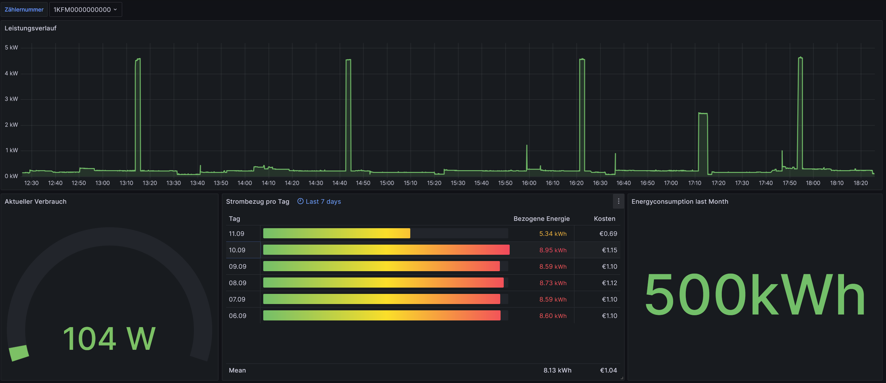
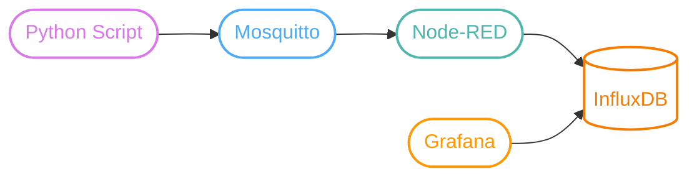

# Über das Projekt


Dieses Projekt basiert auf der Vorarbeit von [greenMikeEU](https://github.com/greenMikeEU) und einer experimentellen Implementierung für das **Bundesland Vorarlberg**.<br>
Die Logik orientiert sich an den Konzepten aus Michael Reitbauers [Blogartikel](https://www.michaelreitbauer.at/kaifa-ma309-auslesen-smart-meter-evn/), welche die automatisierte Erfassung, Speicherung und Visualisierung von Daten des `Kaifa MA309` Drehstromzählers detailliert beschreiben<br>  



# So funktioniert's 
Das System besteht aus mehreren ineinandergreifenden Komponenten, welche folgende Aufgaben übernehmen:
- **Python Script**: Liest die Daten direkt am Zähler aus.
- [**Mosquitto**](https://mosquitto.org/): Fungiert als MQTT-Broker und verteilt die Rohdaten im Netzwerk.
- [**Node-RED**](https://nodered.org/): Nimmt die Daten entgegen und speichert sie strukturiert in der Datenbank ab.
- [**InfluxDB**](https://www.influxdata.com): Eine Datenbank spezialisiert auf Zeitreihen-Datensätze.
- [**Grafana**](https://grafana.com/): Das Dashboard zur visuellen Aufbereitung und Analyse der gesammelten Daten.

Um die Installation so einfach wie möglich zu halten, sind alle Komponenten in [Docker](https://www.docker.com/)-Containern gebündelt. Dadurch lässt sich das gesamte System mit nur einem einzigen Befehl starten.


```mermaid
flowchart LR
    classDef python fill:transparent,stroke:#d977e8,stroke-width:2px,color:#d977e8
    classDef mqtt fill:transparent,stroke:#4dabf5,stroke-width:2px,color:#4dabf5
    classDef nodered fill:transparent,stroke:#4db6ac,stroke-width:2px,color:#4db6ac
    classDef grafana fill:transparent,stroke:#ff9800,stroke-width:2px,color:#ff9800
    classDef influx fill:transparent,stroke:#f57c00,stroke-width:2px,color:#f57c00

    %% Definition der Boxen
    P(["Python Script"]):::python
    M(["Mosquitto"]):::mqtt
    NR(["Node-RED"]):::nodered
    G(["Grafana"]):::grafana
    I[("InfluxDB")]:::influx

    %% Datenfluss
    P --> M
    M --> NR
    NR --> I
    G --> I
```
Die Container sind vorkonfiguriert und basieren auf den weiterführenden Blogartikeln von Michael Reitbauer (*[MQTT Nachrichten in Datenbank speichern](https://www.michaelreitbauer.at/mqtt-nachrichten-in-datenbank-speichern/), [Smartmeter Dashboard in Grafana](https://www.michaelreitbauer.at/smart-meter-dashboard-in-grafana-influxdb/)*).

# Unterstützte Stromzähler

-   Kaifa Drehstromzähler MA309MH4LAT1 (Standard in Vorarlberg)
-   Potentiell weitere Modelle (ungetestet)

# Vorbereitung
## Hardware
-   Kaifa MA309<sub>H4LAT1</sub>
-   Schlüssel für die Kundenschnittstelle. Dieser kann im Online-Portal des Stromanbieters angefordert werden.
-   Raspberry Pi
-   USB zu M-Bus Adapter (Meist günstig auf [eBay](https://www.ebay.at/itm/144514262822) zu finden)
## Software

- Raspberry Pi OS (32-bit getestet)
- Docker & Docker Compose: Können manuell oder über das `install.sh` Skript installiert werden.

# Getting Started
- **Repository kopieren:** 

  Laden Sie das Projekt als ZIP herunter oder klonen Sie es mit:
   ```
   git clone https://github.com/Simeon-byte/SmartMeter.git
   ```
- **Software installieren:**
  Führen Sie das Skript `install.sh` aus, um Docker und notwendige Abhängigkeiten automatisch zu installieren.  
- **Konfiguration:**<a id="configjsonAnlegen"></a>
  
  Erstellen Sie im Ordner `config/` eine Datei namens `config.json` (nutzen Sie `config.example.json` als Vorlage). Hier werden die spezifischen Zähler-Informationen hinterlegt. Diese können von Umgebungsvariablen überschrieben werden.
- **Umgebungsvariablen festlegen:**

  Erstellen Sie eine Datei mit dem Namen `.env` im Hauptverzeichnis. Diese Datei setzt die Passwörter und Ports der Container. Folgende Struktur wird benötigt:  
    ``` 
    ReaderKey="KUNDENSCHNITTSTELLEN_SCHLÜSSEL"
    Comport=/dev/ttyUSB0
    mosquittoPort=1883
    nodeRedPort=1880
    influxPort=8086
    grafanaPort=3000
    grafanaRootPassword="SICHERES_PASSWORT"

    influxdbAdminUser="root"
    influxdbAdminPassword="SICHERES_PASSWORT"
    influxdbUser="smartmeteruser"
    influxdbUserPassword="SICHERES_PASSWORT"
    influxdbDatabase="SmartMeter"
    ```
    ⚠️ Alle Werte können individuell angepasst werden. Eine Änderung der Ports in der `.env` erfordert jedoch manuelle Anpassungen in den Konfigurationsdateien (z.B `grafana_datasource.yml`, `flows.json`, usw.)
- **System starten:** 

  Starten Sie alle Container mit dem Befehl:
  ```
  docker compose up -d
  ``` 
  Der Parameter `-d` sorgt dafür, dass die Container im Hintergrund weiterlaufen.

- **System stoppen:**
  Um alle Dienste zu beenden, nutzen Sie:
  ```
  docker compose down
  ```
  
# <a id="RunPythonStandalone"></a>Skript ohne Docker nutzen

Um das Skript eigenständig (außerhalb von Docker) zu nutzen, müssen Sie die erforderlichen Bibliotheken manuell installieren. Dies geschieht über `pip install -r requirements.txt` oder durch Ausführen des `install.sh` Skripts. Stellen Sie sicher, dass die `config.json` wie [oben](#configjsonAnlegen) beschrieben korrekt konfiguriert wurde. 

# Credits
Originaler [Code](https://github.com/greenMikeEU/SmartMeterEVNKaifaMA309) und [Anleitung](https://www.michaelreitbauer.at/kaifa-ma309-auslesen-smart-meter-evn/) von [greenMikeEU](https://github.com/greenMikeEU).

# License

This project is licensed under the GNU General Public License v3.0 License - see the LICENSE.md file for details
